# QUIZ SYSTEM :mortar_board:
## Desktop Application
  [](https://github.com/abhijeetraj22/Quiz_Systems/releases) [](https://github.com/abhijeetraj22/Quiz_Systems/commit/master) [](https://travis-ci.org/abhijeetraj22/Quiz_Systems)
 - Quiz System is an application that has general questions related to current affairs and computer.

 - It has multiple choice questions with time limit and it also calculate scores of each correct answer.

 - The application helps the user to increase his knowledge.
.
 
 [](https://python.org)
 
 


# How to run the project? :thinking:
 - Clone github repository in your local system  `https://github.com/abhijeetraj22/Quiz_Systems.git`
 - Move in WhatsappBOT repository  `cd Quiz_Systems`
 - Create new virtual python environment  `python3 -m venv venv`
 - Activate virtual python environment  `source venv/bin/activate`
 - Install all the libraries mentioned in [requirements.txt](https://github.com/abhijeetraj22/Quiz_Systems/blob/master/requirements) using  `pip install -r requirements.txt`
 - Run Python file  `python __init__.py` or  `python enter.py` or double click `Quiz.exe` file
 - Select Account Type `Root` and Enter Email `abhijeetraj22@gmail.com` & Password `Raj@2209`
  
 
# Directory Tree :cactus:
```bash
.
├── QuizDetail
│   ├── quizname.txt
│   ├── quizsystem.txt
│   └── quiztype.txt
├── QuizSystemImg
│   ├── adminWin1.jpg
│   ├── adminWin2.jpg
│   ├── adminWin3.jpg
│   ├── adminWin4.jpg
│   ├── ForgetPasswordWin.jpg
│   ├── HomeWin.jpg
│   ├── quizWin1.jpg
│   ├── quizWin2.jpg
│   ├── quizWin3.jpg
│   ├── recoveryWin.jpg
│   ├── RegistrationWin.jpg
│   ├── rootWin1.jpg
│   ├── rootWin2.jpg
│   ├── rootWin3.jpg
│   ├── userWin1.jpg
│   ├── userWin2.jpg
│   ├── userWin3.jpg
│   └── userWin4.jpg
├── venv
│   ├── images
│   ├── include
│   ├── Lib
│   └── Scripts
├── __init__.py
├── admin_panel.py
├── db.py
├── enter.py
├── main.py
├── pass_recov.py
├── python36.pdb
├── Quiz_System.db
├── Quizgame.py
├── root_panel.py
├── set_recov.py
├── testfunct.py
├── user_Panel.py
├── user_regis.py
├── README.md
├── requirements.txt
└── Quiz.exe

9 directories, 25 files
```
### Functionalities
- Provides the searching facilities based on various factors. Such as Quiz , Admin, Participants, Points.
- Quiz System also manage the time for Participants details, Points details, Questions.
- It tracks all the information of Answers, Participants etc.
- Manage the information of Question & Answers.
- Shows the information and description of the Quiz
- To increase efficiency of managing the Questions, Answer.
- It deals with monitoring the information and transactions of Participants.
- Manage the information of Questions.
- Editing, adding and updating of Records is improved which results in proper resource management of Questions data.
- Manage the information of Participants.
- Integration of all records of Points.

## ScreenShot :camera_flash:

**Main Window**<br>
**1).** This is the Main Page of the application.<br><br>
<p align="center">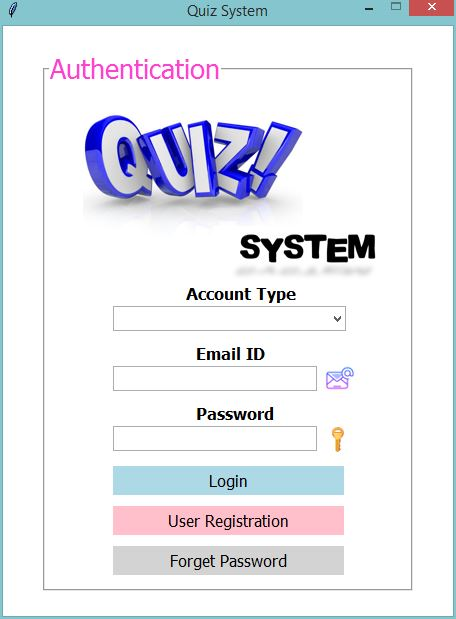</p><br><br>

**Registration Window**
<p align="center">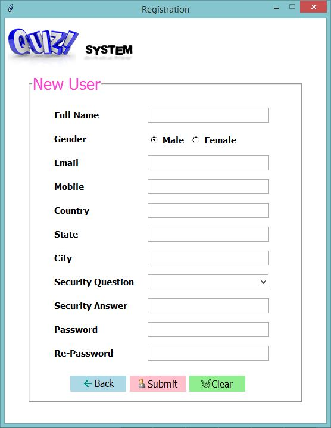</p><br><br>

**Forget Password Window**
<p align="center">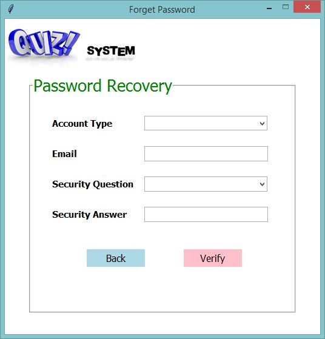</p><br><br>

**Root Window**
<p align="center">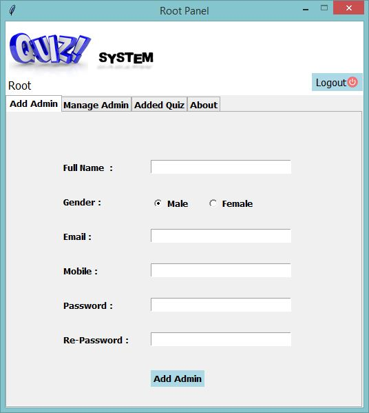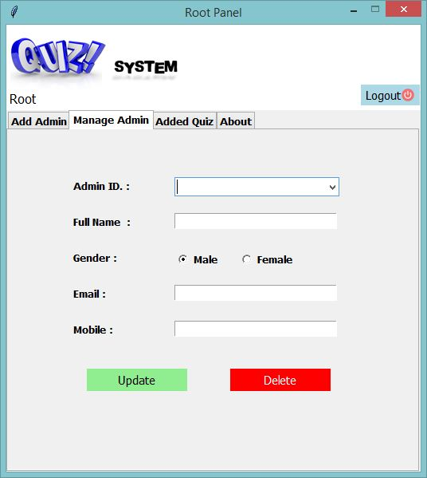</p>
<p align="center">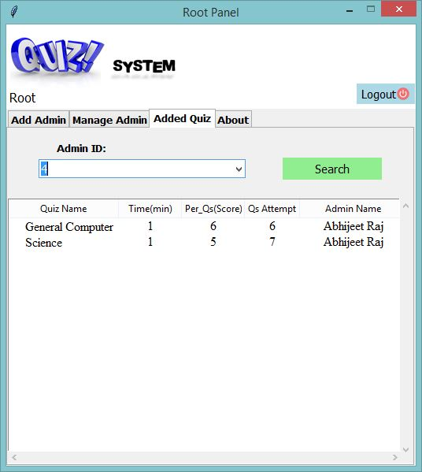</p>

**Admin Window**
<p align="center">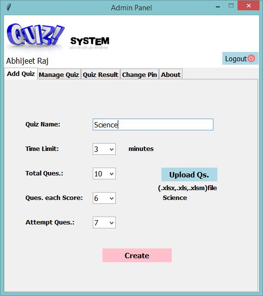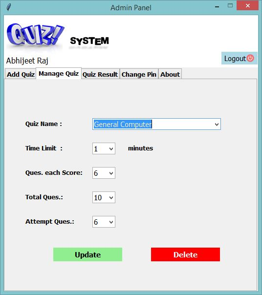</p>
<p align="center">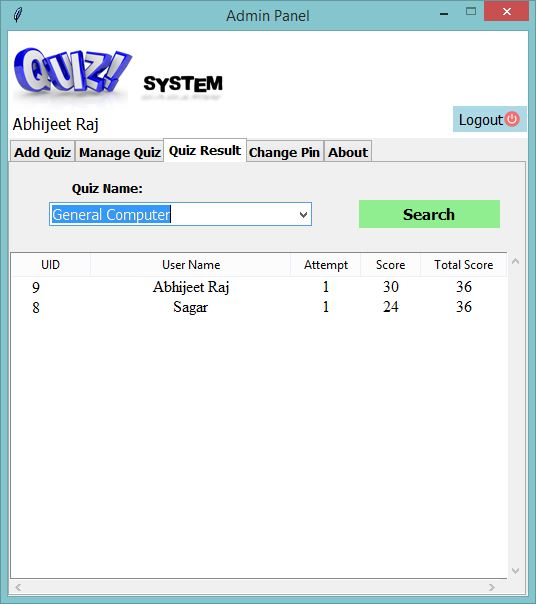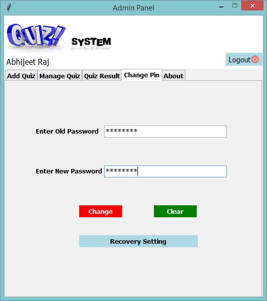</p>

**User Window**
<p align="center">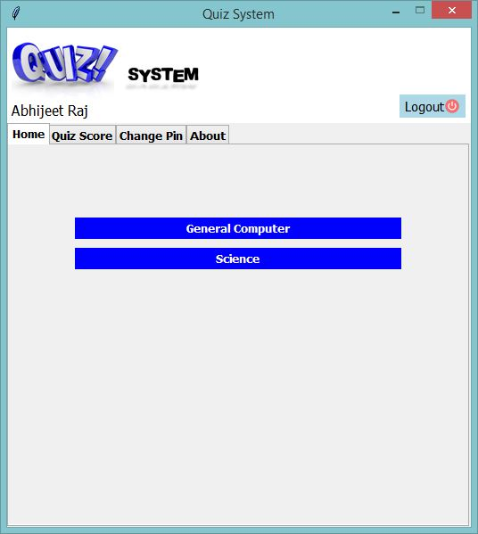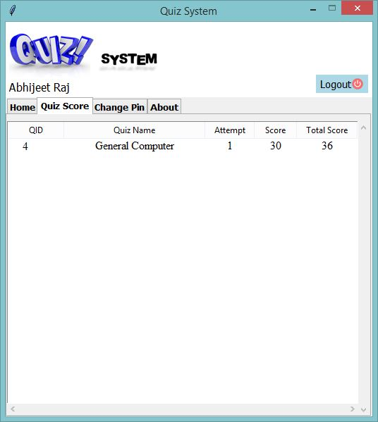</p>
<p align="center">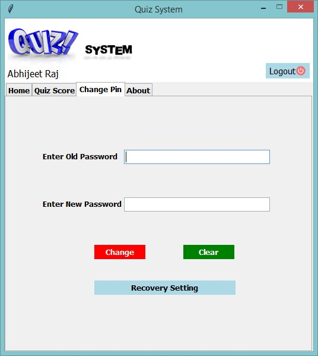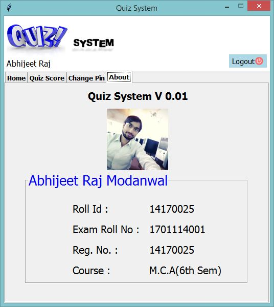</p>

**Quiz Window**
<p align="center">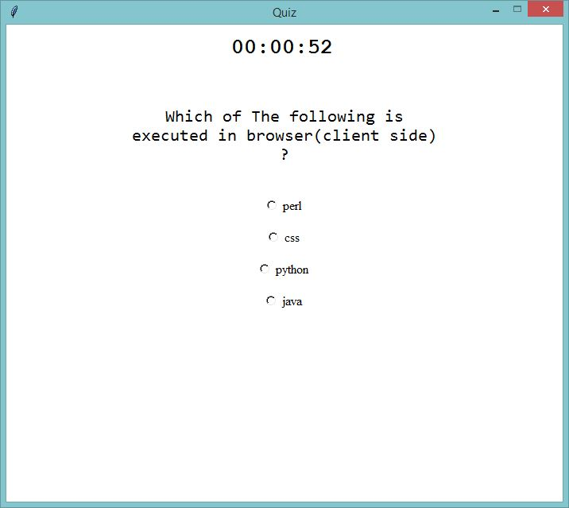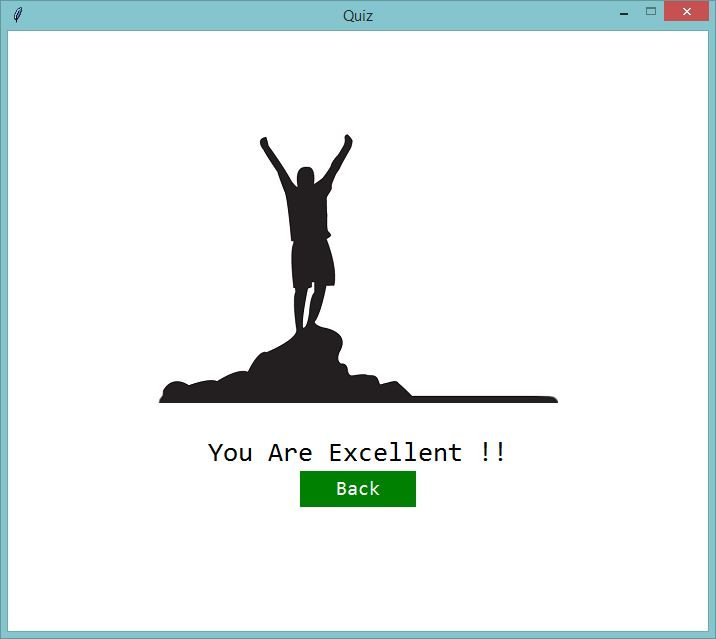</p>

**Set Recovery Window**
<p align="center">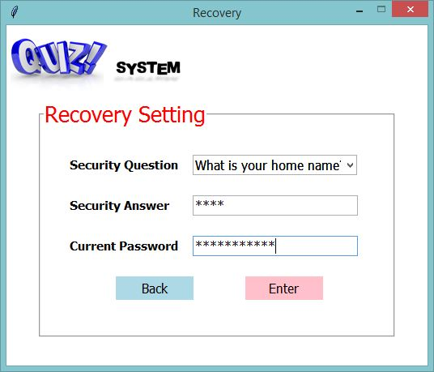</p><br><br>

## Bug / Feature Request :man_technologist:
If you find a bug (the application couldn't handle the query and / or gave undesired results), kindly open an issue [here](https://github.com/abhijeetraj22/Quiz_Systems/issues/new) by including your search query and the expected result.

If you'd like to request a new function, feel free to do so by opening an issue [here](https://github.com/abhijeetraj22/Quiz_Systems/issues/new). Please include sample queries and their corresponding results.

It is my first application with GUI.Thank you !.

## Connect with me! 🌐

[](https://www.linkedin.com/in/rajabhijeet22/)       [](https://github.com/abhijeetraj22)     [](https://www.instagram.com/abhijeet_raj_/?hl=en) [](https://twitter.com/abhijeet_raj_/)
